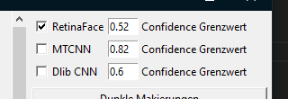
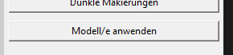
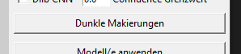
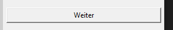

# Evaluierung von Gesichtserkennungsmodellen für historische Gemälde am Beispiel ausgewählter Werke Lucas Cranachs zur optimierten Positionierung von Overlays
Bachelorarbeit SS 25 im Studiengang Medieninformatik an der TH Köln Campus Gummersbach
CranachDetector: GUI + Gesichtserkennung via dlib/MTCNN/RetinaFace

Das Projekt wird von [Prof. Christian Noss](https://www.th-koeln.de/personen/christian.noss/) betreut.
Zweitgutachter ist [Prof. Dr. Daniel Gaida](https://www.th-koeln.de/personen/daniel.gaida/).

Diese Arbeit beschäftigt sich mit dem Testen und Vergleichen von Gesichts­erkennungs­modellen in ihrer Eignung für historische Gemälde. Zusätzlich wurde ein Python-Modul entwickelt, das es ermöglicht, Bilder mit den Gesichts­erkennungs­modellen RetinaFace, MTCNN und Dlib CNN gleichzeitig zu testen. Auf diese Weise ist es möglich, alle Gesichter auf Bildern zu erkennen, bei denen ein einzelnes Modell alleine scheitern würde.
Darüber hinaus enthält das Modul Funktionen, mit denen überprüft werden kann, ob bestimmte Positionen oder Flächen mit einem Gesicht auf einem Bild kollidieren.
Des Weiteren werden erkannte Gesichtsbereiche als Liste ausgegeben, falls die internen Funktionen zur Weiterverarbeitung unzureichend sein sollten. Die ausgegebene Liste kann in eigenen Python-Funktionen verwendet oder in eine JSON-Datei überführt werden, um sie in externen Anwendungen zu nutzen.

Im Rahmen einer Masterarbeit wurden für das Cranach Digital Archive neue Wasserzeichen erstellt. Infolgedessen wurde der Ansatz entwickelt, diese automatisiert auf den verschiedenen Bildern der Werke zu platzieren. Unter Zuhilfenahme von Gesichtserkennungsmodellen sollten die Gesichter aus ästhetischen Gründen ausgespart werden. Das Problem hierbei ist, dass Gesichtserkennungsmodelle hauptsächlich mit Trainingsdaten bestehend aus Gesichtern realer Menschen entwickelt werden und darauf ausgelegt sind, Gesichter realer Personen zu erkennen. Ziel dieser Arbeit ist das Testen und Vergleichen bestehender Gesichtserkennungsmodelle. Es soll festgestellt werden, ob sich diese für den Einsatz auf historischen Gemälden eignen. Sollten sich mehrere Modelle eigenen wird überprüft, welche für den bestimmten Anwendungskontext priorisiert werden. Hierfür werden die Modelle Haar-Cascade, Caffe, MediaPipe, Dlib HOG, Dlib Landmark, Dlib CNN, MTCNN, Yunet und RetinaFace verglichen. Aus den am besten geeigneten Modellen soll anschließend ein Python-Modul entwickelt werden, das die Gesichtsbereiche eines Bildes ausgibt. Mithilfe dieser Daten soll die Möglichkeit gegeben werden zu überprüfen, ob sich ein Overlay potenziell auf einem Gesicht befindet um so einen Automatisierungsprozess für dessen Platzierung zu ermöglichen.

Hier finden Sie das Abschlussvideo zur Arbeit, in dem das Projekt im Videoformat vorgestellt wird: [Abschlussvideo (WIP)]()

## Installationsanweisungen

1. Klonen Sie das Repository:

```shell
git clone https://github.com/NiklasMehlem/captchaCollection.git
```

2. Installieren Sie das Python-Paket:

```shell
cd ./path/to/cranachDetector
pip install .
```

3. Importieren Sie das Paket:

```python
from cranach_detector import *
```

- Alternativ:

```python
from cranach_detector import cranach_detector, isIntersecting, position_isIntersecting, area_isIntersecting
```

# Bedienungshinweise

1. Rufen Sie cranach_detector() auf, um den Gesichterkennungsprozess zu starten. Detaillierte Informationen finden Sie in der Funktionsdokumentation.

```python
cranach_detector()
```


Über die Checkboxen können die verschiedenen Modelle ein- und ausgeschaltet werden. Die Grenzwerte der Modelle wurden bereits optimiert und sollten nur bei Bedarf geändert werden. Um die Grenzwerte zu bearbeiten, geben Sie in das Textfeld des jeweiligen Modells eine Zahl zwischen 0 und 1 ein. Andere Zahlen werden zwar ebenfalls akzeptiert, liegen jedoch außerhalb des üblichen Bereichs der Confidence-Werte der Modelle (Dlib CNN erreicht gelegentlich Werte über 1).
<br clear="both">


Klicken Sie auf den Button „Modell/e anwenden“, um Ihre Einstellungen zu übernehmen. Zuvor erkannte Bereiche im Bild werden gelöscht und durch die Ergebnisse der neuen Einstellungen ersetzt.
<br clear="both">


Sollten die markierten Bereiche auf dem Bild optisch schwer erkennbar sein, können Sie mit dem Button „Dunkle Markierungen“ zwischen dunklen und hellen Markierungen für die erkannten Bereiche wechseln.
<br clear="both">


Mit dem Button „Weiter“ gelangen Sie zum nächsten Bild im Ordner bzw. in der Liste. Dabei werden automatisch alle aktuellen Modelle und Grenzwerte auf das nächste Bild angewendet. Sollten keine weiteren Bilder vorhanden sein, wird die Funktion beendet und die Liste aller markierten Bereiche zurückgegeben.
<br clear="both">

2. position_isIntersecting((x, y), "file_name") Überprüft, ob sich eine Position auf einem von cranach_detector() markierten Gesichtsbereich befindet. Gibt True zurück, falls die Position auf einem Gesicht liegt:

```python
position_isIntersecting((100,100), "Bild.png")
```

- Optional kann auch ein margin angegeben werden, um zu prüfen, ob die Position ausreichend Abstand zu markierten Gesichtsbereichen hat:

```python
position_isIntersecting((100,100), "Bild.png", 50)
```

3. area_isIntersecting((x, y, w, h), "file_name")
Überprüft, ob sich eine Fläche auf einem von cranach_detector() markierten Gesichtsbereich befindet. Gibt True zurück, falls die Fläche mit einem Gesicht kollidiert:

```python
position_isIntersecting((100,100, 75, 75), "Bild.png")
```

- Auch hier kann optional ein margin angegeben werden, um zu prüfen, ob die Fläche ausreichend Abstand zu markierten Gesichtsbereichen hat:

```python
position_isIntersecting((100,100, 75, 75), "Bild.png", 50)
```

4. isIntersecting((x, y, w, h), (x, y, w, h)) Überprüft, ob sich zwei Bereiche überschneiden. Gibt True zurück, falls die Flächen kollidieren.

```python
position_isIntersecting((100,100, 75, 75), (200, 200, 50, 50))
```

## Dependencies & Lizenzen
- **Dlib CNN** (inkl. `mmod_human_face_detector.dat`): Boost Software License 1.0  
- **Matplotlib**: PSF License  
- **InsightFace (Code)**: MIT License (RetinaFace non-commercial research only)  
- **MTCNN**: MIT License
- **NumPy**: BSD-3-Clause
- **OpenCV**: (cv2) BSD-3-Clause
- **Pillow**: PIL Software License
- **Python Std‑Lib**: (pathlib) PSF License 
- **Tkinter**: Python Software Foundation License

# Kontakt
niklas.mehlem@smail.th-koeln.de
oder
niklas.mehlem@gmail.com
